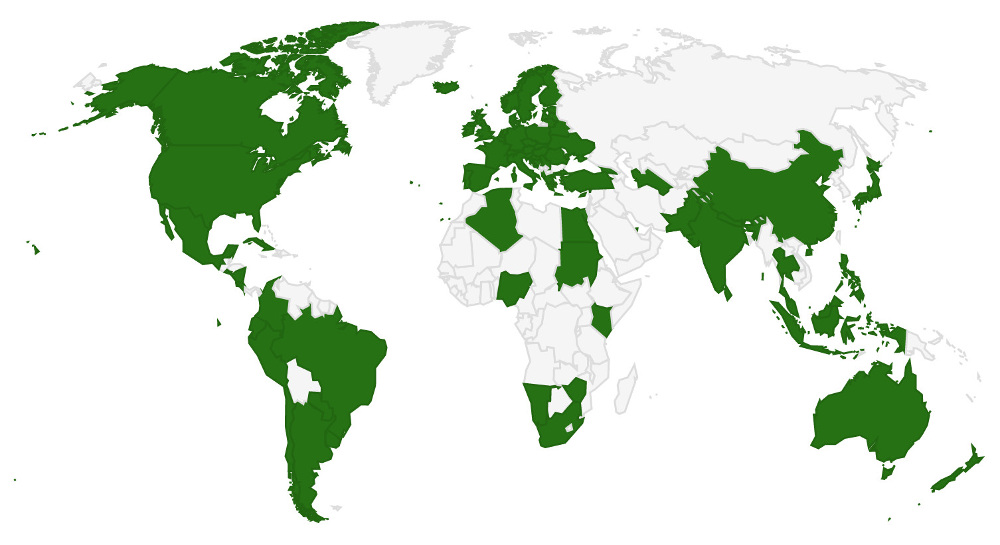

OAIES
========================================================
transition: rotate
author: Sergio Contador
date: Julio 2018
autosize: true
font-family: 'Risque'
css: custom.css

Introducción
========================================================
transition: rotate
type: photo

Esta aplicación recolecta las direcciones web de más de 1100 proveedores españoles de datos y/o servicios que utilizan el protocolo de comunicación OAI-PMH (Open Access Initiative - Protocol for Metadata Harvesting).

Secciones
========================================================
transition: rotate
type: photo

Esta aplicación está dividida en cinco partes o secciones:

- Acceso Abierto.
- OAI-PMH.
- Proveedores OAI-PMH.
- Proveedores Mundiales.
- Proveedores Españoles.

Acceso Abierto
========================================================
transition: linear
type: photo

¿Que es el Acceso Abierto?
Manera libre y gratuita de acceder a la literatura científica.  

¿Donde encontrar la literatura científica?
En los Repositorios

¿Que son los Repositorios?
Sitios centralizados donde se almacena y mantiene la información digitalizada.
La información se distribuye a través de una red informática que se comunica con diferentes protocolos de interoperatibilidad.

Uno de los principales protocolos es OAI-PMH.

OAI-PMH
========================================================
transition: linear
type: photo

OAI-PMH: Open Access Initiative - Protocol for Metadata Harvesting.

Protocolo de comunicación de metadatos en formato Dublin Core.

Utiliza multiples proveedores de datos (PD) que se comunican con múltiples proveedores de servicios (PS).

PD almacenan y mantienen los repositorios.

PS buscan los PD y los usan como base para la creación de servicios de valor añadido.

PS hace una petición de metadatos al PD.

En respuesta, PD envía un conjunto de registros en formato XML.

Proveedores OAI-PMH
========================================================
transition: linear
type: photo

Existen miles de proveedores de datos OAI-PMH:

[E-Prints Complutense](https://eprints.ucm.es/)

[Archivo Digital UPM](http://oa.upm.es/)

[Dspace at MIT](https://dspace.mit.edu/)

[Harvard University Library Virtual Collections](https://staff.library.harvard.edu/lts)

Proveedores OAI-PMH
========================================================
transition: linear
type: photo

Existen cientos de proveedores de servicios OAI-PMH:

[OAI (Open Archive Initiative)](https://www.openarchives.org/)

[OpenDOAR (Directory of Open Access Repositories)](http://v2.sherpa.ac.uk/opendoar/)

[ROAR (Registry of Open Access Repositories)](http://roar.eprints.org/)

[DOAJ (Drectory of Open Access Journals)](https://doaj.org/)

[DIALNET (Universidad de la Rioja)](https://dialnet.unirioja.es/)

Proveedores Mundiales
========================================================
transition: concave
type: photo

Proveedores OAI-PMH en más de 80 paises.

Proveedores Españoles
========================================================
transition: concave
type: photo

La aplicación muestra información a cerca de los proveedores españoles. En concreto, el usuario puede visualizar cinco características de cada repositorio:

<table>
 <thead>
  <tr>
   <th style="text-align:left;"> VARIABLE </th>
   <th style="text-align:left;"> DESCRIPCIÓN </th>
  </tr>
 </thead>
<tbody>
  <tr>
   <td style="text-align:left;"> nombre </td>
   <td style="text-align:left;"> nombre del proveedor de datos </td>
  </tr>
  <tr>
   <td style="text-align:left;"> url </td>
   <td style="text-align:left;"> uniform resource locator del proveedor de datos </td>
  </tr>
  <tr>
   <td style="text-align:left;"> url_oai </td>
   <td style="text-align:left;"> uniform resource locator para el acceso a los metadatos del proveedor de datos </td>
  </tr>
  <tr>
   <td style="text-align:left;"> tipo </td>
   <td style="text-align:left;"> tipo de proveedor de datos </td>
  </tr>
  <tr>
   <td style="text-align:left;"> divulgador </td>
   <td style="text-align:left;"> institución propietaria del proveedor de datos </td>
  </tr>
</tbody>
</table>

========================================================
transition: linear
type: photo

Te recomendamos que pruebes todas estas funcionalidades ¡¡[aquí](https://scontador.shinyapps.io/OAIES)!!

